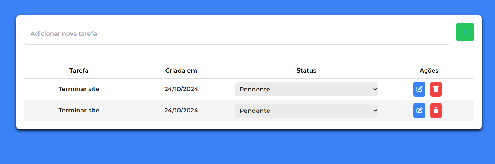

# 📋 Lista de Tarefas - Projeto Full Stack

Este é um projeto Full Stack de uma Lista de Tarefas onde o usuário pode:

- Adicionar novas tarefas ✅
- Definir o status das tarefas como Pendente, Em andamento ou Concluída 🔄
- Editar tarefas 🖊️
- Excluir tarefas 🗑️

O projeto está estruturado separadamente em Frontend e Backend, permitindo escalabilidade e organização.

  

### 🚀 Tecnologias Utilizadas

📌 Backend (API REST):
- Node.js
- Express.js
- MySQL

🎨 Frontend:
- HTML
- CSS
- JavaScript
- Tailwind CSS

### 🛠️ Como Rodar o Projeto

🔧 Backend

Acesse a pasta backend e instale as dependências:

cd backend
npm install

Inicie o servidor:

npm start

O backend estará rodando em http://localhost:3000

🎨 Frontend

Acesse a pasta frontend e abra o arquivo index.html no navegador.
